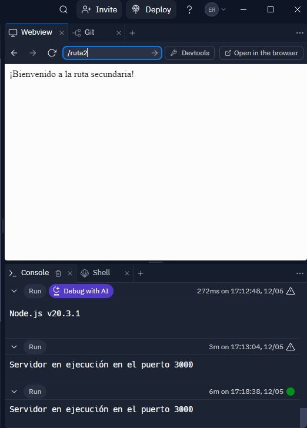

# Actividad_9

## Aplicación con Node.js y Express.js
### Nombre: Erick Ramírez  

Proyecto básico utilizando Node.js y Express.js para comprender la configuración inicial y la gestión de rutas

### Ruta 1
  

### Ruta 2
  
